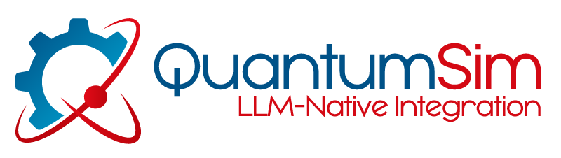

## I. Introduction

Welcome to the QS SecureGPT Prompt Cookbook. This document contains several prompt engineering techniques to help you maximize productivity gains from using an LLM.

But first, let’s start with some basic terminology that we will use throughout. A large language model, or LLM, is the technology underneath QS SecureGPT. An LLM is a specific kind of *generative AI* (GenAI), meaning a kind of artificial intelligence that generates content. In our case, that content is text, though there are other GenAI models that output other content like images, video, and code.

GenAI is called so in opposition to other kinds of artificial intelligence, like natural language processing (NLP), which is more commonly used in decision-making contexts. For example, AI is often used in claims processing to partially automate adjudication. But an NLP engine does not itself generate new content.

The use of LLMs was popularized in late 2022 by the release of OpenAI’s ChatGPT—the first general use LLM. ChatGPT is a *fine-tuning* of an underlying model, sometimes called a “foundation model.” To “fine-tune” a model means to feed it specific data (often examples of what you want the model to do) that allows it to become better at a specific task. So OpenAI’s foundation model (originally GPT-3, now GPT-3.5 and GPT-4) was fine-tuned to become adept at question answering. The result of fine tuning the foundational model was ChatGPT—an LLM trained specifically as a chatbot.

You may have heard that ChatGPT “contains 1.76 trillion parameters” or weights. The technical meaning of parameter is irrelevant to our purposes; all you need to know is that the number of parameters roughly scales with the power of the LLM. The more parameters, the more creative and interesting the output of the LLM.

However, larger models also require more computing resources. It has been generally found that many smaller models can be trained on specific tasks or in specific domains and perform well as the larger, general use models.

You may have also heard that ChatGPT was “trained on 13 trillion tokens.” Again, the technical meaning of a token is irrelevant for our purposes. All you need to know is that a “token” is a way to represent human language in a way a computer can understand and that one hundred tokens represents about seventy five words.

When using an LLM, the request sent to the LLM is referred to as a *prompt*. A prompt can be any text, like “Can you summarize this document?” A prompt should contain some kind of instruction for the LLM.

Prompt engineering, then, is the art of writing prompts that efficiently accomplish your goal. Much like with humans, *how* you ask the LLM to do a specific task can influence how well it performs the task.

Below we explain prompt engineering techniques with many examples. Much like a software tutorial, we have found that the best way to begin with LLMs is to copy/paste the examples and observe the behavior of the LLM. And the exercises following the examples will provide you with an opportunity to start developing your own intuition for how to efficiently get accurate and useful output.

You can think of this in the same way as “learning how to Google.” While just searching keywords will often get you decent results, learning specific techniques—like using quotation marks, “site:...”, and “-{negative keyword}” for example—will greatly enhance your Google results.

Part of the reason that prompt engineering is important is that LLMs can “hallucinate,” which means they can generate content that is untrue or misleading. So our prompt engineering techniques help you both get a result more efficiently and help ensure that it is accurate and factual.

Some miscellaneous notes to keep in mind as you progress through: 

- User requests can be copied with the button on the top right
- The LLM output is from QS-LLM Fast unless otherwise noted
- Because LLM output is not deterministic, sending the same prompts to the same LLMs does not always return the same results.
