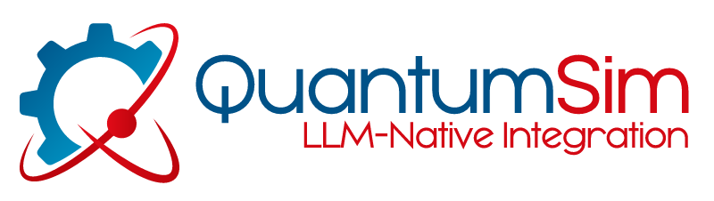

# QS Prompt Cookbook

## [I. Introduction](/I_Introduction/introduction.md)

## [II. LLM Use Cases](/II_LLM_Use_Cases/LLM_Use_Cases.md)

### A. Free Chat
- [UC01: Summary](/II_LLM_Use_Cases/UC01_Summary.md)
- [UC02: Keywords](/II_LLM_Use_Cases/UC02_Keywords.md)
- [UC03: Intent](/II_LLM_Use_Cases/UC03_Intent.md)
- [UC04: Sentiment](/II_LLM_Use_Cases/UC04_Sentiment.md)
- [UC05: Classification](/II_LLM_Use_Cases/UC05_Classification.md)
- [UC06: Expansion](/II_LLM_Use_Cases/UC06_Expansion.md)
- [UC07: Ideation (Guided Example)](/II_LLM_Use_Cases/UC07_Ideation_Guided_Example.md)

### B. Document Chat
- [Healthcare Document — Benefits Rider](/II_LLM_Use_Cases/Healthcare_Document_Benefits_Rider.md)
- [Healthcare Document — Plan Modification](/II_LLM_Use_Cases/Healthcare_Document_Plan_Modification.md)
- [Legal Document — Warranty](/II_LLM_Use_Cases/Legal_Document_Warranty.md)

## [III. Prompt Engineering Patterns](#)
- [Persona](/III_Prompt_Engineering_Patterns/Persona.md)
- [Problem Action Result (PAR)](/III_Prompt_Engineering_Patterns/Problem_Action_Result_PAR.md)
- [Contrastive (or Contractual) Prompting](/III_Prompt_Engineering_Patterns/Contrastive_or_Contractual_Prompting.md)
- [Role Task Format (RTF)](/III_Prompt_Engineering_Patterns/Role_Task_Format_RTF.md)
- [Chain of Thought](/III_Prompt_Engineering_Patterns/Chain_of_Thought.md)
- [Avoiding Hallucinations](/III_Prompt_Engineering_Patterns/Avoiding_Hallucinations.md)

## [IV. Tips](/IV_Tips/tips.md)

## [V. References](/V_References/references.md)
